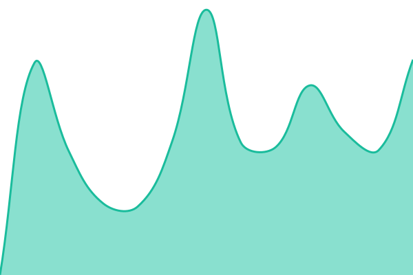

# [📈 Live Status](https://pbarriat.github.io/elic-status): <!--live status--> **🟧 Partial outage**

This repository contains the open-source uptime monitor and status page for [pbarriat](https://pbarriat.github.io/elic-status), powered by [Upptime](https://github.com/upptime/upptime).

With [Upptime](https://upptime.js.org), you can get your own unlimited and free uptime monitor and status page, powered entirely by a GitHub repository. We use [Issues](https://github.com/pbarriat/elic-status/issues) as incident reports, [Actions](https://github.com/pbarriat/elic-status/actions) as uptime monitors, and [Pages](https://pbarriat.github.io/elic-status) for the status page.

<!--start: status pages-->
<!-- This summary is generated by Upptime (https://github.com/upptime/upptime) -->
<!-- Do not edit this manually, your changes will be overwritten -->
<!-- prettier-ignore -->
| URL | Status | History | Response Time | Uptime |
| --- | ------ | ------- | ------------- | ------ |
|  [Website](https://www.elic.ucl.ac.be) | 🟩 Up | [website.yml](https://github.com/pbarriat/elic-status/commits/HEAD/history/website.yml) | 

 1617ms
     
 | 

<a href="https://pbarriat.github.io/elic-status/history/website">97.33%</a>
    

|  [Gogs](https://gogs.elic.ucl.ac.be) | 🟩 Up | [gogs.yml](https://github.com/pbarriat/elic-status/commits/HEAD/history/gogs.yml) | 

 954ms
     
 | 

<a href="https://pbarriat.github.io/elic-status/history/gogs">97.43%</a>
    

|  [Shiny](https://shiny.elic.ucl.ac.be) | 🟩 Up | [shiny.yml](https://github.com/pbarriat/elic-status/commits/HEAD/history/shiny.yml) | 

 808ms
     
 | 

<a href="https://pbarriat.github.io/elic-status/history/shiny">97.52%</a>
    

|  [Ferdium](https://ferdium.elic.ucl.ac.be) | 🟩 Up | [ferdium.yml](https://github.com/pbarriat/elic-status/commits/HEAD/history/ferdium.yml) | 

 861ms
     
 | 

<a href="https://pbarriat.github.io/elic-status/history/ferdium">98.95%</a>
    

|  [Nextcloud](https://nextcloud.elic.ucl.ac.be) | 🟥 Down | [nextcloud.yml](https://github.com/pbarriat/elic-status/commits/HEAD/history/nextcloud.yml) | 

 597ms
     
 | 

<a href="https://pbarriat.github.io/elic-status/history/nextcloud">0.00%</a>
    

<!--end: status pages-->

[**Visit our status website →**](https://pbarriat.github.io/elic-status)

## 📄 License

- Powered by: [Upptime](https://github.com/upptime/upptime)
- Code: [MIT](./LICENSE) © [Anand Chowdhary](https://anandchowdhary.com), supported by [Pabio](https://pabio.com)
- Data in the `./history` directory: [Open Database License](https://opendatacommons.org/licenses/odbl/1-0/)
